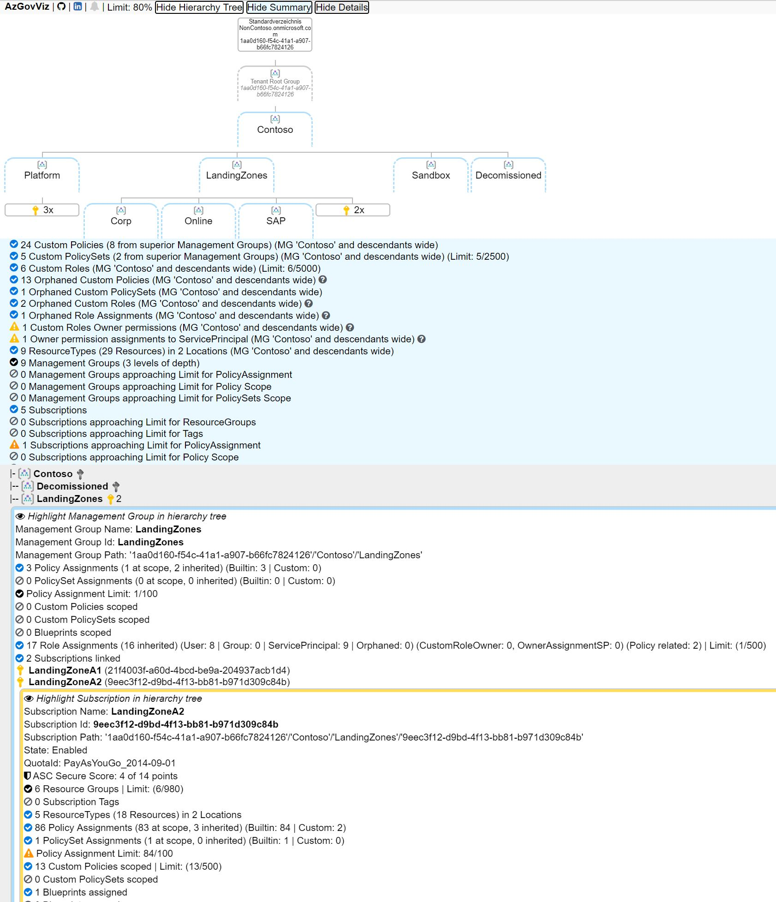

# AzGovViz - Azure Governance Visualizer

Do you want to have visibility on your Tenant´s Management Group hierarchy - document it in csv, html and markdown? This script iterates your Tenant´s Management Group hierarchy down to Subscription level. It captures most relevant Azure governance capabilities and creates a visible hierarchy.

You can run the script either for your Tenant Root Group or any other Management Group that you have read access on.

## AzGovViz Version 2

The new version comes with a handful of enhancements:

* Optimized user experience for the HTML output
* Summary for Tenant / selected Management Group scope
* Reflect Tenant, ManagementGroup and Subscription Limits for Azure Governance capabilities
* Some security related best practice highlighting
* More details: Management Groups, Subscriptions, Policies, Policy Sets (Initiatives), Orphaned Policies, RBAC and Policy related RBAC (DINE MI), Orphaned Roles, Orphaned RoleAssignments, Blueprints, Subscription State, Subscription QuotaId, Subscription Tags, Azure Scurity Center Secure Score, ResourceGroups count, Resource types and count by region, Limits, Security findings
* Resources / ResourceGraph paging; supports tenants with > 1000 subscriptions
* Parameter based output (hierarchy only, 'srubbed' user information and more..)
* HTML version check

### Demo

[AzGovViz Demo](https://www.azadvertizer.net/azgovviz/demo/AzGovViz_Contoso_Demo.html)

### Screenshots

detailed html file

*_IDs from screenshot are randomized_

basic markdown in Azure DevOps Wiki

*_IDs from screenshot are randomized_

### Outputs

* CSV file
* HTML file
  * the html file uses Java Script and CSS files which are hosted on various CDNs (Content Delivery Network). For details review the BuildHTML region in the AzGovViz.ps1 script file.
  * Browsers tested: Edge, new Edge and Chrome
* MD (markdown) file
  * for use with Azure DevOps Wiki leveraging the [Mermaid](https://docs.microsoft.com/en-us/azure/devops/release-notes/2019/sprint-158-update#mermaid-diagram-support-in-wiki) plugin

> note: there is some fixing ongoing at the mermaid project to optimize the graphical experience:  
 <https://github.com/mermaid-js/mermaid/issues/1289>  
 <https://github.com/mermaid-js/mermaid/issues/1177>

### Required permissions in Azure

* RBAC Role: _Reader_ on Management Group level
* API permissions: If you run the script in Azure Automation or on Azure DevOps hosted agent you will need to grant API permissions in Azure Active Directory (get-AzRoleAssignment cmdlet requirements?!). The Automation Account or Service Connection __App registration (Application)__ must be granted with: __Azure Active Directory API | Application | Directory | Read.All__ (admin consent might be required)

### Usage

#### PowerShell

* Requires PowerShell Az Modules
  * Az.Accounts
  * Az.Resources
  * Az.ResourceGraph
* Usage
  * `.\AzGovViz.ps1 -managementGroupId <your-Management-Group-Id>`
* Parameters
  * ManagementGroupId
  * CsvDelimiter (the world is split into two kind of delimiters - comma and semicolon - choose yours)
  * OutputPath
  * AzureDevOpsWikiAsCode
  * DoNotShowRoleAssignmentsUserData (scrub user information)
  * LimitCriticalPercentage (limit warning level, default is 80%)
  * HierarchyTreeOnly (hierarchy only, much faster than the default full query)
  * ~~UseAzureRM parameter~~ support for AzureRm modules has been deprecated
* Passed tests: Powershell Core on Windows
* Passed tests: Powershell 5.1.18362.752 on Windows
* Passed tests: Powershell Core on Linux Ubuntu 18.04 LTS

#### Azure DevOps Pipeline

The provided example Pipeline is configured to run based on a [shedule](https://docs.microsoft.com/en-us/azure/devops/pipelines/build/triggers?view=azure-devops&tabs=yaml#scheduled-triggers) (every 6 hours). It will push the AzGovViz markdown output file to the wikiRepo which will feed your Wiki.

1. In Azure DevOps make sure to [enable](https://docs.microsoft.com/en-us/azure/devops/project/navigation/preview-features?view=azure-devops&tabs=new-account-enabled) the Multistage Pipelines feature <https://docs.microsoft.com/en-us/azure/devops/pipelines/get-started/multi-stage-pipelines-experience?view=azure-devops>
2. Clone the AzGovViz Repo
3. Create an additional Repo 'wikiRepo' (hosting AzGovViz outputs)
4. Create Wiki by choosing [Publish Code as Wiki](https://docs.microsoft.com/en-us/azure/devops/project/wiki/publish-repo-to-wiki?view=azure-devops&tabs=browser), define the Repo 'wikiRepo' as source
5. Create Pipeline, configure your pipeline selecting __Existing Azure Pipelines YAML file__, select the AzGovViz YAML from the AzGovViz (Azure-MG-Sub-Governance-Reporting) Repo
6. Permissions: In order to allow the pipeline to push files to our wikiRepo the __Project Collection Build Service(%ORGNAME%)__ must be granted __Contribute__ and __Create Branch__ permissions

> The __Project Collection Build Service(%ORGName%)__ seems only to become available after at least one pipeline has run - so just trigger the pipeline, expect an error and after the run grant the permissions as pointed out in __6.__  
> Make sure your Service Connection has the required permissions (see __Required permissions in Azure__).

#### Security

AzGovViz creates very detailed information about your Azure Governance setup. In your organizations best interest the outputs __should be protected from not authorized access!__

### Facts

Subscriptions where QuotaId starts with with "AAD_" are being skipped, all others are queried (<https://docs.microsoft.com/en-us/azure/cost-management-billing/costs/understand-cost-mgt-data#supported-microsoft-azure-offers>).  

Limits are not acquired programmatically, they are hardcoded. The links used to check related Limits are commented in the param section of the script.

## Contributions

Please feel free to contribute. Thanks to so many supporters - testing, giving feedback, making suggestions, presenting use-case, posting/blogging articles, refactoring code - THANK YOU!

Special thanks to: Tim Wanierke, Brooks Vaughn, Friedrich Weinmann

## AzAdvertizer

Also check <https://www.azadvertizer.net> to keep up with the pace on Azure Governance capabilities such as Azure Policies, Policy Initiatives, Policy Aliases, RBAC Roles and Resource Providers including operations.
