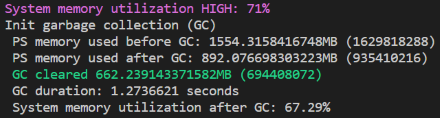
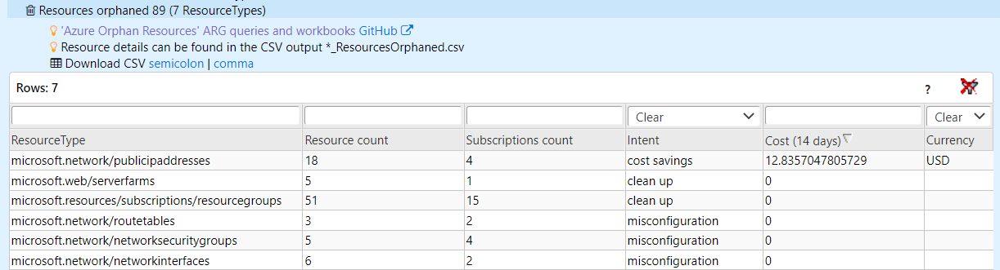
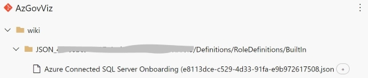
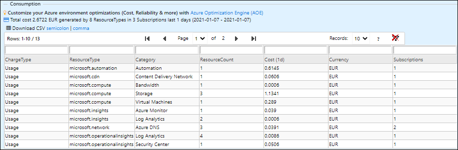
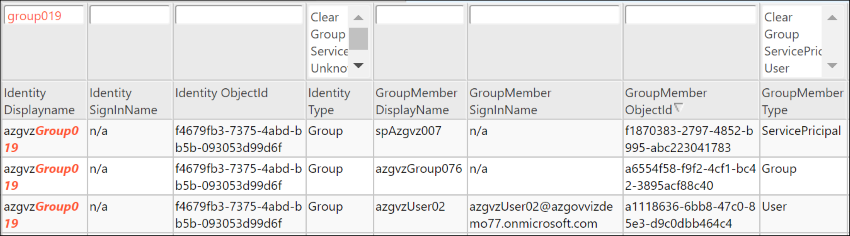
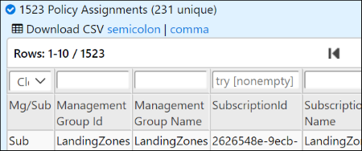

# AzGovViz - Azure Governance Visualizer

## AzGovViz version history

### AzGovViz version 6

__Changes__ (2022-Sep-30 / Major)

* Fix issue #135 
  * Embedded GitHub Actions OIDC (Open ID Connect) specific functionality to reconnect and get new token ([AzAPICall](https://aka.ms/AzAPICall))
  * New parameter `-GitHubActionsOIDC` which is only to be used for GitHub Actions `/.github/workflows/AzGovViz_OIDC.yml`
  * Updated `/.github/workflows/AzGovViz_OIDC.yml` to use the new parameter `-GitHubActionsOIDC`
* Fix issue #136
  * Handle return for Storage Accounts located in managed Resource Groups  
  &#127800; Call for contribution: Please review the list of known [managed Resource Groups](https://github.com/JulianHayward/AzSchnitzels/blob/main/info/managedResourceGroups.txt) and contribute if you can, thanks!
* Added missing variable `NoStorageAccountAccessAnalysis` in `.azuredevops/pipelines/AzGovViz.variables.yml`
* Use [AzAPICall](https://aka.ms/AzAPICall) PowerShell module version 1.1.30

__Changes__ (2022-Sep-28 / Major)

* New feature 'Storage Account Access Analysis' - provides insights on Storage Accounts with focus on anonymous access (containers/blobs and 'Static website' feature). Data is provided in the HTML __TenantSummary__ (Subscriptions, Resources & Defender) and as CSV export
  * New parameter `-NoStorageAccountAccessAnalysis` - do not execute the feature
  * New parameter `-StorageAccountAccessAnalysisSubscriptionTags` - define the Subscription tags that should be added to the CSV output
  * New parameter `-StorageAccountAccessAnalysisStorageAccountTags` - define the Storage Account (resource) tags that should be added to the CSV output
  * Updated `.azuredevops/pipelines/AzGovViz.variables.yml` accordingly
* Rename 'ALZ EverGreen' feature to 'Azure Landing Zones (ALZ) Policy Version Checker'
  * Replaced parameter ~~`-NoALZEverGreen`~~ with `-NoALZPolicyVersionChecker`
* Use [AzAPICall](https://aka.ms/AzAPICall) PowerShell module version 1.1.24
* Optimizations

__Changes__ (2022-Sep-17 / Major)

* Fix Azure DevOps Pipeline correct addressing of NoDefinitionInsights variable in YAML
* Fix issue #132
* Add __[Contribution Guide](contributionGuide.md)__

__Changes__ (2022-Sep-12 / Major)

* New feature 'ALZ EverGreen' - Azure Landing Zones EverGreen for Policy and Set definitions. AzGovViz will clone the ALZ GitHub repository and collect the ALZ policy and set definitions history. The ALZ data will be compared with the data from your tenant so that you can get lifecycle management recommendations for ALZ policy and set definitions that already exist in your tenant plus a list of ALZ policy and set definitions that do not exist in your tenant. The ALZ EverGreen results will be displayed in the __TenantSummary__ and a CSV export `*_ALZEverGreen.csv` will be provided. Thanks! ALZ Team 
  * New parameter `-NoALZEverGreen` - Do not execute the ALZ EverGreen feature
* Update: Per default __DefinitionInsights__ will be written to a separate HTML file. This will improve the html file handling (browser memory usage /response time / user experience). 
  * Note: Please update your Azure DevOps and GitHub YAML files with the latest versions if you are using the webApp publishing feature
  * New parameter `-NoDefinitionInsightsDedicatedHTML` (__DefinitionInsights__ will NOT be written to a separate HTML file `*_DefinitionInsights.html`)
* Add Resource fluctuation detailed (`*_ResourceFluctuationDetailed.csv`) CSV output (add/remove, scope details, resource details)
* Fix consumption reporting for large tenants with more than 3k subscriptions (_Management Group abc has too many subscriptions <count>, exceeding CCM API Current Limit 3000_)
* Fix CSV export `*_PolicySetDefinitions.csv` - Builtin Policy definitions contained in PolicySet definitions will only show the GUID instead of the full ID as for large PolicySet definitions the field size limit in Excel may be exceeded (column: PoliciesUsed4CSV)
* BuiltIn definitions collection - add 'Static' Policy definitions (part of __DefinitionInsights__ and `*_PolicyDefinitions.csv`)
* Fix __HierarchyMap__ image quality (now .png (aka 'peng')). Thanks! Brooks Vaughn
* Use [AzAPICall](https://aka.ms/AzAPICall) PowerShell module version 1.1.23
* Optimizations
__Changes__ (2022-Aug-17 / Major)

* __Update: IMPORTANT Fix__ for custom Role definitions / missing DataActions and NotDataActions
  * Update [API reference](#api-reference) roleDefinitions use API version 2018-07-01 (API version 2022-04-01 not available in sovereign clouds)
* BugFix

__Changes__ (2022-Aug-03 / Major)

* __IMPORTANT Fix__ for custom Role definitions / missing DataActions and NotDataActions
  * Update [API reference](#api-reference) roleDefinitions use API version 2022-04-01
* BugFix

__Changes__ (2022-Jul-31 / Major)

* Update on feature 'PIM (Privileged Identity Management) eligible Role assignments'
    * Integrate with RoleAssignmentsAll (HTML, CSV)  
      
    * New parameter `-NoPIMEligibilityIntegrationRoleAssignmentsAll` - Prevent integration of PIM eligible assignments with RoleAssignmentsAll (HTML, CSV)
* Fix: PIM 'Assigned' and 'Activated' Role assignments now also reflect inheritance for lower scopes
* Bugfixes & optimizations

__Changes__ (2022-Jul-28 / Major)

* Update on feature 'PIM (Privileged Identity Management) eligible Role assignments'
    * new parameter `-PIMEligibilityIgnoreScope` - By default will only report for PIM Elibility for the scope (`ManagementGroupId`) that was provided. If you use the new switch parameter then PIM Eligibility for all onboarded scopes (Management Groups and Subscriptions) will be reported.
    * Add CSV output
    * Add inheritance information
* Use [AzAPICall](https://aka.ms/AzAPICall) PowerShell module version 1.1.21
* Bugfixes

__Changes__ (2022-Jul-26 / Major)

* New feature 'PIM (Privileged Identity Management) eligible Role assignments' (TenantSummary)  
&#x26D4; ___Breaking Change!___ requires API permissions update!
    * Get a full report of all PIM eligible Role assignments for Management Groups and Subscriptions, including resolved User members of AAD Groups that have assigned eligibility
    * Spoiler: Next iteration will include ScopeInsights, showing entire eligible Role assignments on Subscriptions including from upper Management Group scopes
    * &#x1F4A1; Note: this feature requires to execute as Service Principal with `Application` API permission `PrivilegedAccess.Read.AzureResources`
* Use [AzAPICall](https://aka.ms/AzAPICall) PowerShell module version 1.1.19
* Bugfixes

__Changes__ (2022-Jul-22 / Minor)

* New parameter `-PSRuleFailedOnly` - PSRule for Azure will only report on failed resource (may save some space/noise)

__Changes__ (2022-Jul-17 / Major)

* This change impacts __GitHub Actions only__: As the PSRule CSV output can become quite big and GitHub is actively blocking files larger than 100MB ([reference](https://docs.github.com/en/repositories/working-with-files/managing-large-files/about-large-files-on-github#file-size-limits)), the file size of the export will be validated and in case the 100MB limit is exceeded a new export excluding the column 'description' will be initiated. If that still is too large then also the column 'recommendation' will be exluded. If even then the export is exceeding the limit then the export will be deleted in order not to break the workflow at push to repo. Issue ref: #121
* New parameter `-CriticalMemoryUsage` - Define at what percentage of memory usage the garbage collection should kick in (default=90). Example: `.\pwsh\AzGovVizParallel.ps1 -CriticalMemoryUsage 70`   

* Minor optimizations

__Changes__ (2022-Jul-14 / Major)

* New feature - Cloud Adoption Framework (CAF) [Recommended abbreviations for Azure resource types](https://docs.microsoft.com/en-us/azure/cloud-adoption-framework/ready/azure-best-practices/resource-abbreviations) compliance (HTML TenantSummary, ScopeInsights and CSV output)
* Optimize PSRule data handling
* Minor optimizations

__Changes__ (2022-Jul-10 / Major)

* Enhanced the 'Orphaned Resources' feature: if you run AzGovViz with parameter -DoAzureConsumption then the orphaned resources output will show you potential cost savings for orphaned resources with intent 'cost savings':  
  
&#x1F4A1; use parameter `-AzureConsumptionPeriod 14` to get consumption data for the last 14 days (default = 1 day)
* New feature HierarchyMap (HTML): save the HierarchyMap as image (.jpeg)
* 2022-Jul-07 PR #117 - Updated GitHub Actions OIDC (Open ID Connect) workflow: establish new connection to Azure before the 'HTML to WebApp' publishing task - thanks Dimitri Zilber
* Use [AzAPICall](https://aka.ms/AzAPICall) PowerShell module version 1.1.18
* Bugfixes
* Minor optimizations

__Changes__ (2022-Jul-01 / Major)

* Fix change tracking date conversion issue with certain date format (removed ToString)
* Minor optimizations

__Changes__ (2022-Jun-22 / Major)

* New feature 'Orphaned Resources' - Azure Resource Graph based reporting on orphaned resources (TenantSummary, ScopeInsights, CSV export). [Azure Orphan Resources - GitHub](https://github.com/dolevshor/azure-orphan-resources) ARG queries and workbooks by Dolev Shor
* New feature 'Resource fluctuation' - Compare against Resources from previous run and output aggregated summary of the Resource fluctuation (TenantSummary, CSV export)
* Fix `/providers/Microsoft.Authorization/roleAssignmentScheduleInstances` AzAPICall errorhandling (error 400, 500)
* Optimize procedure to update the AzAPICall module
* Use AzAPICall PowerShell module version 1.1.17
* Updated [HTML Demo](https://www.azadvertizer.net/azgovvizv4/demo/AzGovViz_demo.html)

__Changes__ (2022-Jun-14 / Major)

* Fix issue #110 / handle `DisallowedProvider` errorCode (Blueprints, PolicyInsights)
* Fix issue #111 / replace .AddRange with foreach/.Add
* Use AzAPICall PowerShell module version 1.1.16

__Changes__ (2022-Jun-10 / Major)

* Fix issue #110 / handle `DisallowedProvider` errorCode (Microsoft Defender for Cloud plans for Subscriptions)
* Use AzAPICall PowerShell module version 1.1.15
* Remove Azure DevOps 'PSRule for Azure' workaround / use latest PSRule.Rules.Azure PowerShell module version (current: 1.16.0)

__Changes__ (2022-Jun-03 / Major)

* Optimize Policy Exemption output (HTML TenantSummary, CSV output)
* Update Azure DevOps variables YAML - add parameter `-DebugAzAPICall`
* Update PSRule CSV output sorting

__Changes__ (2022-Jun-02 / Major)

* Fix ClassicAdministrators for non applicable Subscription offers
* Use AzAPICall version 1.1.13

__Changes__ (2022-May-31 / Major)

* New feature - Report on 'Classic Administrators' for Subscriptions -> TenantSummary, ScopeInsights and CSV export
* Fix consumption reporting (issue #101 - handle error: 'Management group `<ManagementGroupId>` does not have any valid subscriptions')
* PSRule for Azure / Azure DevOps dependencies (Az.Resources) workaround -> use PSRule for Azure version 1.14.3 (else latest)

__Changes__ (2022-May-21 / Major)

> Note: Azure DevOps and GitHub users must update the YAML file(s) and PowerShell files (`AzGovVizParallel.ps1` and `prerequisites.ps1`)

* Integration of [PSRule for Azure](#integrate-psrule-for-azure). This feature is optional, use new parameter `-DoPSRule`
  * Provides a [Azure Well-Architected Framework](https://docs.microsoft.com/en-gb/azure/architecture/framework/) aligned suite of rules for validating Azure resources
  * Provides meaningful information to allow remediation
  * New parameter `-PSRuleVersion` - Define the PSRule..Rules.Azure PowerShell module version, if undefined then 'latest' will be used
* Optional feature: publish HTML to Azure Web App (check the __[Setup Guide](setup.md)__) in Azure DevOps or GitHub Actions - thanks Wayne Meyer
* New feature / report on [enabled Subscription Features](https://docs.microsoft.com/en-us/azure/azure-resource-manager/management/preview-features) TenantSummary, ScopeInsights and CSV export
* Decomissioned Azure DevOps `.pipelines` - use the new YAML files `.azuredevops/pipelines/*` 
* Fix [#issue92](https://github.com/JulianHayward/Azure-MG-Sub-Governance-Reporting/issues/92) -> pipeline .azuredevops/pipelines/AzGovViz.pipeline.yml
* Update Azure DevOps pipelines / use AzurePowershell@5
* Update prerequisites.ps1

__Changes__ (2022-May-05 / Major)

* fix: `using:scriptPath` variable in foreach parallel (this is only relevant for Azure DevOps and GitHub if you have a non default folder structure in your repository)

__Changes__ (2022-May-02 / Minor)

* __Tenant Summary__ Change Tracking - RBAC Role assignments: add PIM (Privileged Identity Management) information
* Azure DevOps pipeline YAML - change `vmImage: 'ubuntu-18.04'` to  `vmImage: 'ubuntu-20.04'`
* Published new HTML [demo](https://www.azadvertizer.net/azgovvizv4/demo/AzGovViz_demo.html)

__Changes__ (2022-May-01 / Major)

* Switch from ARM API endpoint `roleAssignmentSchedules` to `roleAssignmentScheduleInstances`, switch from api-version `2020-10-01-preview` to `2020-10-01`
* Update GitHub Actions workflows
* Update `pwsh/prerequisites.ps1` script (relevant for GitHub Actions and Azure DevOps Pipeline)
* Update __[API reference](#api-reference)__
* Update __[Setup Guide](setup.md)__
* Bugfix

__Changes__ (2022-Apr-25 / Major)

* New JSON output *_PolicyAll.json - Contains all relations of Policy/Set definitions and Policy assignments
* New parameter `-ShowMemoryUsage` - Shows memory usage at memory intense sections of the scripts, this shall help you determine if the the worker is well sized for AzGovViz
* Leveraging AzAPICall PowerShell module. The AzAPICall function has been removed from the AzGovViz code base and has been published as a module to the [PoweShell Gallery](https://www.powershellgallery.com/packages/AzAPICall) ([GitHub](https://aka.ms/AzAPICall))
* Foreach -parallel import the AzAPICall module instead of $using:
* Optimize GitHub Actions workflows (YAML)
* Added list of [APIs](#api) that are polled by AzGovViz
* Microsoft Graph `v1.0/directoryObjects/getByIds` do batching is exceeds 1000 identities
* Performance optimization
* Bugfixes

__Changes__ (2022-Jan-31 / Major)

* New __TenantSummary | RBAC__ feature - insights on all Role definitions that are capable to write Role assignments
* __TenantSummary | Subscriptions, Resources & Defender | Subscriptions__ report (new) [Role assignment limits](https://docs.microsoft.com/en-us/azure/role-based-access-control/troubleshooting#azure-role-assignments-limit)
* Handling orphaned Policy assignments (scope Management Group)
* Datacollection for Management Groups process in batches (batch per Management Group level)
* Update Dockerfile
* Update API version for Resources, ResourceGroups and Subscriptions
* Further enrich _PolicyDefinitions and _PolicySetDefinitions CSV outputs
* HTML file performance optimization
* Include instructions for GitHub Actions in the __[Setup Guide](setup.md)__
* New [demo](https://www.azadvertizer.net/azgovvizv4/demo/AzGovViz_demo.html) uploaded
* Bugfixes

__Changes__ (2022-Jan-16 / Major)

* New parameter `-ManagementGroupsOnly` - collect data only for Management Groups (Subscription data such as e.g. Policy assignments etc. will not be collected)
* New feature __TenantSummary | Subscriptions, Resources & Defender__, __TenantSummary | Azure Active Directory__ and __ScopeInsights__ insights on UserAssignedIdentities/Resources - which resource has an user assigned managed identity assigned / vice versa. Includes CSV export. Thanks to Thomas Naunheim (Microsoft Azure MVP) for inspiration :)
* New feature __TenantSummary | Policy | Policy assignments orphanded__ (Policy assignments's Policy definition does not exist / likely Management Group scoped Policy defintion - Management Group deleted)
* Optimize __DefinitionInsights__ collapsible JSON definitions
* Defender plans usage / highlight use of depcrecated plans such as Container Registry & Kubernetes
* New 'Large Tenant' feature __TenantSummary | Policy | Policy assignments__ if the number of Policy assignments exceeds the `-HtmlTableRowsLimit` parameter's value (default = 20.000) then the html table will not be created / the CSV file will still be created 
* New feature  __TenantSummary | Azure Active Directory | AAD ServicePrincipals type=ManagedIdentity__ orphaned Managed Identities (for Policy assignment related Managed Identities - Policy assignment does not exist anymore)
* Fix PIM (Priviliged Identity Management) state for inherited Subscription Role assignments
* __TenantSummary | Azure Active Directory__ add link to [AzADServicePrincipalInsights](#azadserviceprincipalinsights) (POC)
* Add CSV export for Policy Exemptions
* Add workflow files (YAML) for GitHub Actions (one for [OpenID Connect (OIDC)](https://docs.github.com/en/actions/deployment/security-hardening-your-deployments/configuring-openid-connect-in-azure))
* Bugfixes
* HTML output patch jQuery / use latest version 3.6.0
* Update [Demo](https://www.azadvertizer.net/azgovvizv4/demo/AzGovViz_demo.html)
* AzAPICall enhanced error handling (GeneralError, ResourceGroupNotFound)
* Script optimization / prepare for PS module

__Changes__ (2021-Dec-10 / Minor)

* deprecation of parameter `-AzureDevOpsWikiAsCode` / Based on environment variables the script will detect the code run platform
* changed throttlelimit default from 5 to 10

__Changes__ (2021-Dec-09 / Minor)

* [Run AzGovViz in GitHub CodeSpaces](https://github.com/JulianHayward/Azure-MG-Sub-Governance-Reporting/blob/master/setup.md#azgovviz-github-codespaces) - __thanks!__ Carlos Mendible (Microsoft Cloud Solution Architect - Spain)
* JSON output update -> filenames will indicate if Role assignment is PIM (Priviliged Identity Management) based

__Changes__ (2021-Nov-23 / Major)

* Add Microsoft Defender for Cloud 'Defender Plans' reporting (__TenantSummary__ -> Subscriptions, Resources & Defender; __ScopeInsights__ -> Defender Plans)
* Adopt to new naming Azure Security Center (ASC) / Microsoft Defender for Cloud. Renamed parameter `-NoASCSecureScore` to `-NoMDfCSecureScore` (old parameter will still work)
* Update policyAssignment API version '2020-09-01' to '2021-06-01'
* Fix __ScopeInsights__ Tags usage
* Fix dateTime formatting / use default format (createdOn/updatedOn)
* Consumption feature has potential to fail. Changed Azure Consumption feature default = disabled; introducing new parameter `-DoAzureConsumption`
* Changed `-HtmlTableRowsLimit` default from 40.000 to 20.000 
* CSV output related changes
  * Update *_RoleAssignments.csv output (add column for scope ResourceGroup name; add column for scope Resource name)
  * Optimize *_PolicyDefinitions.csv and *_PolicySetDefinitions.csv file content / add BuiltIn definitions
  * Add CSV export *_ResourceProviders.csv (all Resource Providers and their states for all Subscriptions)
  * Add CSV export *_RoleDefinitions.csv (BuiltIn and Custom including some enriched information)
* AzAPICall update error handing for 'Resource diagnostic settings' and 'AAD groups transitive members count'
* Script optimization

__Changes__ (2021-Nov-01 / Major)

* New output - Feature request to create __Scope Insights__ output per Subscription has been implement. With this new feature you can share Subscription __Scope Insights__ with Subscription responsible staff. Use parameter `-NoSingleSubscriptionOutput` to disable the feature
* Update [Required permissions in Azure Active Directory](#required-permissions-in-azure-active-directory) for the scenario of a Guest User executing the script
* Add 'daily summary' output (CSV) to easily track your Tenant´s Governance evolution over time - Tim will hopefully create a PR for how he leverages AzGovViz historical data for Azure Log Analytics based dashboards
* Improved permission related error handling 

__Changes__ (2021-Oct-25 / Major)

* AzAPICall enhanced error handling (general error 'An error has occurred.' ; roleAssignment schedules)

__Changes__ (2021-Oct-21 / Major)

* AzAPICall enhanced error handling (GatewayAuthenticationFailed; roleAssignment schedules)

__Release v6 Changes__

* Removed usage of Azure PowerShell cmdlet 'Get-AzRoleAssignment' / preparing for upcoming deprecation of 'Azure Active Directory Graph' API ([announcement](https://azure.microsoft.com/en-us/updates/update-your-apps-to-use-microsoft-graph-before-30-june-2022/))
* Management Group diagnostic setting - reflect inheritance of diagnostic settings from upper Management Group scopes
* __TenantSummary__ Policy assignments - resolve Managed Identity (if Policy assignment effect is DeployIfNotExists (DINE) or Modify)
* Removed __TenantSummary__ RBAC Classic Role assignments
* Improved AzAPICall error handling and output
* Azure DevOps pipeline (yml) updated prerequisites to include Repository 'contribute' permission check
* Added Application Insights [stats](#stats)
* Performance optimization
* Bugfixes

### AzGovViz version 5

__Changes__ (2021-Sep-19 / Major)

* Fix Issue #60
* Fix JSON file creation / path containing brackets
* AzAPICall enhanced error handling (ClientCertificateValidationFailure)
* Minor performance optimization
* Bugfixes

__Changes__ (2021-Sep-13 / Major)

* Fix Issue #58
* Add Windows invalid character usage (Management Group, Subscription, Policy/Set definition, Rolicy assignment, Role definition)

__Changes__ (2021-Sep-08 / Major)

* Update AzAPICall handle variants of throttled requests

__Changes__ (2021-Sep-07 / Minor)

* Update AzAPICall CostManagement return
* Fix markdown output (Management Group Hierarchy leveraging Mermaid plugin); hierarchy broken when not executing against Tenant Root Group but child Management Group

__Changes__ (2021-Sep-03 / Major)

* AzAPICall enhanced error handling

__Changes__ (2021-Sep-01 / Major)

* Update AzAPICall CostManagement return

__Changes__ (2021-Aug-30 / Major)

* Adding feature for RBAC Role assignments: determine 'standing' from PIM (Privileged Identity Mangement) managed Role assignments
* New parameter `-NoResources` - this will speed up the processing time but information like Resource diagnostics capability and resource type stats will not be made available (featured for large tenants)
* Integrate AzGovViz with AzOps (after 'AzOps - Push' run AzGovViz) - (line 77 AzGovViz.yml). Checkout [AzOps Accellerator](https://github.com/Azure/AzOps-Accelerator)
* Performance optimization

__Changes__ (2021-Aug-25 / Major)

* Resource diagnostics capability for logs and metrics will only be checked for 1st party (Microsoft) Resource types

__Changes__ (2021-Aug-22 / Major)

* Bugfix - indirect Role assignments (applied through AAD group membership); switched to Graph beta endpoint as v1.0 only resolves users and groups, whilst we´re also interested in Service Principals - [List group transitive members](https://docs.microsoft.com/en-us/graph/api/group-list-transitivemembers)

__Changes__ (2021-Aug-18 / Major)

* Added ASC Secure Score for Management Groups
* Policy Compliance - if API returns 'ResponseTooLarge' then flag Policy Compliance entries with 'skipped' for given scope
* Added [demo-output](demo-output) folder containing all outputs (html, csv, md, json, log)
* Bugfixes

__Changes__ (2021-Aug-06 / Major)

* Enriched Policy assignments with list of used parameters
* Enriched Role assignments on Groups with Group member count
* Optimize JSON outputs
* CSP scenario error handling
* Bugfixes
* Performance optimization

__Changes__ (2021-July-28 / Major)

* As demanded by the community reactivated parameters `-PolicyAtScopeOnly` and `-RBACAtScopeOnly`
* New paramter `-AADGroupMembersLimit`. Defines the limit (default=500) of AAD Group members; For AAD Groups that have more members than the defined limit Group members will not be resolved 
* New parameter `-JsonExportExcludeResourceGroups` - JSON Export will not include ResourceGroups (Policy & Role assignments)
* New parameter `-JsonExportExcludeResources`- JSON Export will not include Resources (Role assignments)
* Bugfixes
* Performance optimization

__Changes__ (2021-July-22 / Major)

* Full blown JSON definition output. Leveraging Git with this new capability you can easily track any changes that occurred in between the previous and last AzGovViz run.  
  
_* a new BuiltIn RBAC Role definition was added_
* Renamed parameter `-PolicyIncludeResourceGroups` to , `-DoNotIncludeResourceGroupsOnPolicy` (from now Policy assignments on ResourceGroups will be included by default)
* Renamed parameter `-RBACIncludeResourceGroupsAndResources` to , `-DoNotIncludeResourceGroupsAndResourcesOnRBAC` (from now Role assignments on ResourceGroups and Resources will be included by default)
* New parameter `-HtmlTableRowsLimit`. Although the parameter `-LargeTenant` was introduced recently, still the html output may become too large to be processed properly. The new parameter defines the limit of rows - if for the html processing part the limit is reached then the html table will not be created (csv and json output will still be created). Default rows limit is 40.000
* Added NonCompliance Message for Policy assignments
* Cosmetics
* Bugfixes
* Performance optimization

__Changes__ (2021-July-07 / Major)

* Replaced parameters ~~`-NoScopeInsights`,~~ `-RBACAtScopeOnly` and `-PolicyAtScopeOnly` with `-LargeTenant`. A large tenant is a tenant with more than ~500 Subscriptions - the HTML output for large tenants simply becomes too big, therefore will not create __ScopeInsights__ and will not show inheritance for Policy and Role assignments in the __TenantSummary__ (html) output
* Add Tenant to __HierarchyMap__ including count of Role assignments
* Executing against any child Management Group will show all parent Management Groups in __HierarchyMap__
* Cosmetics / Icons
* Bugfixes
* Performance optimization - optimized data collection to reduce memory utilization -> __big, fat 'Thank You'__ to Tim Wanierke and Brooks Vaughn

__Changes__ (2021-June-16 / Minor)

* added detailed [Setup](setup.md) instructions

__Changes__ (2021-June-07 / Major)

* Breaking Changes
  * Changed parameter `-CsvExport` to `-NoCsvExport` - You will need to explicitly deny CSV export using `-NoCsvExport`
  * Changed parameter `-JsonExport` to `-NoJsonExport` - You will need to explicitly deny JSON export using `-NoJsonExport`
* __HierarchyMap__ enrich Management Groups with counts on Policy assignments, scoped Policy definitions and Role assignments
* Enhanced Management Group and Subscription Diagnostic settings / list Management Groups and Subscriptions that do not have Diagnostic settings applied
* Updated API error codes / throttle handling
* Bugfixes

__Changes__ (2021-June-01 / Feature)

* Added Management Group and Subscription Diagnostic settings
* Restructure __TenantSummary__ - 'Diagnostics' gets its own section

__Changes__ (2021-May-19)

* Removed Azure PowerShell module requirement Az.ResourceGraph 
* __TenantSummary__ 'Change tracking' section. Tracks newly created and updated custom Policy, PolicySet and RBAC Role definitions, Policy/RBAC Role assignments and Resources that occured within the last 14 days (period can be adjusted using new parameter `-ChangeTrackingDays`)
* New parameters `-PolicyIncludeResourceGroups` and `-RBACIncludeResourceGroupsAndResources` - include Policy assignments on ResourceGroups, include Role assignments on ResourceGroups and Resources
* New parameters `-PolicyAtScopeOnly` and `-RBACAtScopeOnly` - removing 'inherited' lines in the HTML file; use this parameter if you run against a larger tenants
* New parameter `-CsvExport` - export enriched data for 'Role assignments', 'Policy assignments' data and 'all resources' (subscriptionId, managementGroup path, resourceType, id, name, location, tags, createdTime, changedTime)
* !_experimental_ New parameter `-JsonExport`- export of ManagementGroup Hierarchy including all MG/Sub Policy/RBAC definitions, Policy/RBAC assignments and some more relevant information to JSON
* Added ClassicAdministrators Role assignment information
* Restructure __TenantSummary__ - Limits gets its own section
* Added sytem metadata for Policy/RBAC definitions and assignments
* New parameter `-FileTimeStampFormat`- define the time format for the output files (default is `yyyyMMdd_HHmmss`)
* Updated API error codes
* Cosmetics / Icons
* Bugfixes
* Performance optimization

__Changes__ (2021-Mar-26)

* Code adaption to prevent billing related errors in sovereign cloud __AzureChinaCloud__ (.Billing n/a)
* New parameter `-SubscriptionId4AzContext` - Define the Subscription Id to use for AzContext (default is to use a random Subscription Id)
* New parameter `-AzureDevOpsWikiHierarchyDirection` - Azure DevOps Markdown Management Group hierarchy tree direction. Use 'TD' for Top->Down, use 'LR' for Left->Right (default is 'TD'; use 'LR' for larger Management Group hierarchies)
* Bugfixes
* Performance optimization

__Breaking Changes__ (2021-Feb-28)

* When granting __Azure Active Directory Graph__ API permissions in the background an AAD Role assignment for AAD Group __Directory readers__ was triggered automatically - since January/February 2021 this is no longer the case. Review the updated [__AzGovViz technical documentation__](#azgovviz-technical-documentation) section for detailed permission requirements.

__Let´s accellerate by going parallel!__  (2021-Feb-14)

* Support for PowerShell Core ONLY! No support for PowerShell version < 7.0.3
* New section __DefinitionInsights__ - Insights on all built-in and custom Policy, PolicySet and RBAC Role definitions
* New parameter `-NoScopeInsights` - Q: Why would you want to do this? A: In larger tenants the ScopeInsights section blows up the html file (up to unusable due to html file size)
* New parameter `-ThrottleLimit` - Leveraging PowerShell Core´s parallel capability you can define the ThrottleLimit (default=5)
* New parameter `DoTranscript` - Log the console output
* Parameter `SubscriptionQuotaIdWhitelist` now expects an array
* Renamed parameter `-NoServicePrincipalResolve` to `-NoAADServicePrincipalResolve`
* Renamed parameter `-ServicePrincipalExpiryWarningDays` to `-AADServicePrincipalExpiryWarningDays`
* Bugfixes

__Note:__ In order to run AzGovViz Version 5 in Azure DevOps you also must use the v5 pipeline YAML.

### AzGovViz version 4

Updates 2021-Jan-26
* Role Assigments indicate if User is Member/Guest
* Enrich information for Policy assignment related ServicePrincipal/Managed Identity (Policy assignment details on policy/set definition and Role assignments)
* Preloading of <a href="https://www.tablefilter.com/" target="_blank">TableFilter</a> removed for __TenantSummary__ PolicyAssignmentsAll and RoleAssignmentsAll (on poor hardware loading the HTML file took quite long)
* Fix 'Orphaned Custom Roles' bug - thanks to Tim Wanierke
* More bugfixes
* Performance optimization

Updates 2021-Jan-18
* Feature: __Policy Exemptions__
* Feature: __ResourceLocks__
* Feature: __Tag Name Usage__
* Feature: __Cost Management / Consumption Reporting__ - use another API
* Bugfixes

Updates 2021-Jan-08
* Feature: __Cost Management / Consumption Reporting__ - Changed AzureConsumptionPeriod default to 1 day  

* Bugfixes

Updates 2021-Jan-06 - Happy New Year
* Feature: Resolve __Azure Active Directory Group memberships__ for Role assignment with identity type 'Group' leveraging Microsoft Graph. With this capability AzGovViz can ultimately provide holistic insights on permissions granted for Management Groups and Subscriptions (honors parameter `-DoNotShowRoleAssignmentsUserData`). Use parameter `-NoAADGroupsResolveMembers` to disable the feature  

* Feature: New __TenantSummary__ section '__Azure Active Directory__' -> Check all Azure Active Directory Service Principals (type=Application that have a Role assignment) for Secret/Certificate expiry. Mark all Service Principals (type=ManagedIdentity) that are related to a Policy assignments. Use parameter `-NoServicePrincipalResolve` to disable this feature
* Feature: __Cost Management / Consumption Reporting__ for Subscriptions including aggregation at Management Group level. Use parameter `-NoAzureConsumption` to disable this feature.  
__Note__: Per default the consumption query will request consumption data for the last full 1 day (if you run it today, will capture the cost for yesterday), use the parameter `-AzureConsumptionPeriod` to define a favored time period  e.g. `-AzureConsumptionPeriod 7` (for 7 days) 
* Removed parameter `-Experimental`. 'Resource Diagnostics Policy Lifecycle' enabled by default. Use `-NoResourceDiagnosticsPolicyLifecycle` to disable the feature.
* Renamed parameter `-DisablePolicyComplianceStates` to `-NoPolicyComplianceStates` for better consistency
* Optimize 'Get Resource Types capability for Resource Diagnostics' query - thanks Brooks Vaughn
* Update Pipeline to honor [master/main change](https://devblogs.microsoft.com/devops/azure-repos-default-branch-name)
* Add info to HTML file on parameters used
* Performance optimization

Updates 2020-Dec-17
* Now supporting > 5000 entities (Subscriptions/Management Groups) :) thanks Brooks Vaughn

Updates 2020-Dec-15
* Pipeline `azurePowerShellVersion: latestVersion` / ensures compatibility with latest [Az.ResourceGraph 0.8.0 Release](https://github.com/Azure/azure-powershell/releases/tag/Az.ResourceGraph-v0.8.0)
* Error handling optimization / API
* Fix 'deprecated Policy assignments'
* Fix 'orphaned Custom Role definitions'

Updates 2020-Nov-30
* New parameter ~~`-DisablePolicyComplianceStates`~~ `-NoPolicyComplianceStates` (see [__Parameters__](#powerShell))
* Error handling optimization / API

Updates 2020-Nov-25
* Highlight default Management Group
* Add AzAPICall debugging parameter `-DebugAzAPICall`
* Fix for using parameter `-HierarchyMapOnly`

Updates 2020-Nov-19
* New parameter `-Experimental` (see [__Parameters__](#powerShell))
* Performance optimization
* Error handling optimization / API
* Azure DevOps pipeline worker changed from 'ubuntu-latest' to 'ubuntu-18.04' (see [Azure Pipelines - Sprint 177 Update](https://docs.microsoft.com/en-us/azure/devops/release-notes/2020/pipelines/sprint-177-update#ubuntu-latest-pipelines-will-soon-use-ubuntu-2004), [Ubuntu-latest workflows will use Ubuntu-20.04 #1816](https://github.com/actions/virtual-environments/issues/1816))

Updates 2020-Nov-08
* Re-model Bearer token handling (Az PowerShell Module Az.Accounts > 1.9.5 no longer provides access to the tokenCache [GitHub issue](https://github.com/Azure/azure-powershell/issues/13337))
* Adding Scope information for Custom Policy definitions and Custom PolicySet definitions sections in __TenantSummary__
* Cosmetics and User Experience enhancement
* New [__demo__](#demo)

Updates 2020-Nov-01
* Error handling optimization
* Enhanced read-permission validation
* Toggle capabilities in __TenantSummary__ (avoiding information overload)

Updates 2020-Oct-12
* Adding option to download HTML tables to csv  

* Preloading of <a href="https://www.tablefilter.com/" target="_blank">TableFilter</a> removed for __ScopeInsights__ (on poor hardware loading the HTML file took quite long)
* Added column un-select option for some HTML tables
* Performance optimization

Release v4
* Resource information for Management Groups (Resources in all child Subscriptions) in the __ScopeInsights__ section
* Excluded Subscriptions information (whitelisted, disabled, AAD_ QuotaId)
* Bugfixes, Bugfixes, Bugfixes
* Cosmetics and User Experience enhancement
* Performance optimization
* API error handling / retry optimization
* New Parameters `-NoASCSecureScore`, `-NoResourceProvidersDetailed` (see [__Parameters__](#powerShell))

### AzGovViz version 3

* HTML filterable tables
* Resource Types Diagnostics capability check
* ResourceDiagnostics Policy Lifecycle recommendations (experimental)
* Resource Diagnostics Policy Findings
* Resource Provider details
* Policy assignments filter excluded scopes
* Use of deprecated uilt-in Policy definitions
* Subscription QuotaId Whitelist

### AzGovViz version 2

* Optimized user experience for the HTML output
* __TenantSummary__ / selected Management Group scope
* Reflect Tenant, ManagementGroup and Subscription Limits for Azure Governance capabilities
* Some security related best practice highlighting
* More details: Management Groups, Subscriptions, Policy definitions, PolicySet definitions (Initiatives), orphaned Policy definitions, RBAC and Policy related RBAC (DINE MI), orphaned Role definitions, orphaned Role assignments, Blueprints, Subscription State, Subscription QuotaId, Subscription Tags, Azure Scurity Center Secure Score, ResourceGroups count, Resource types and count by region, Limits, Security findings
* Resources / leveraging Azure Resource Graph
* Parameter based output (hierarchy only, 'srubbed' user information and more..)
* HTML version check