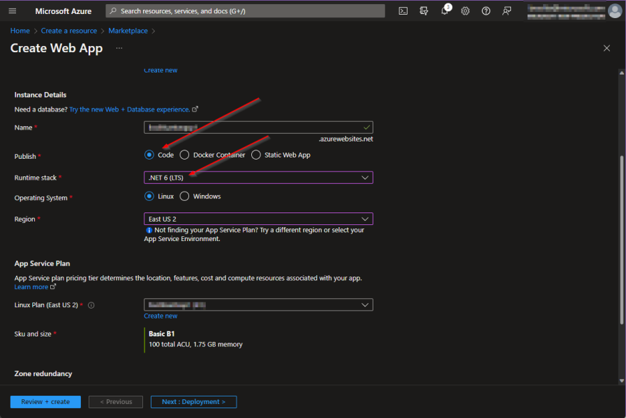
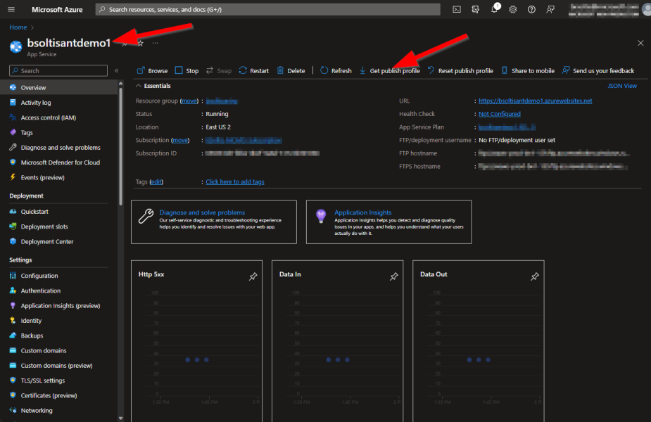
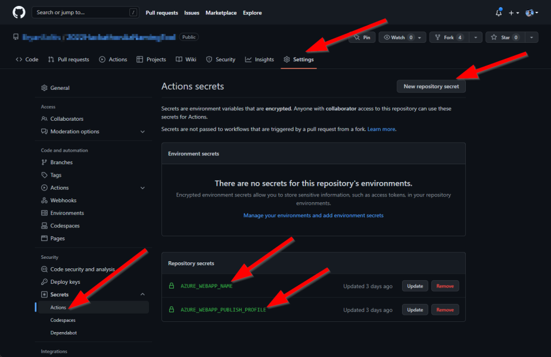

[Overview](./) | [Installation](INSTALLATION.md) | [Updating](UPDATING.md) | [Using the API](USINGTHEAPI.md) | [Version History](VERSIONHISTORY.md) | [FAQ](FAQ.md) | [Contributors](CONTRIBUTORS.md)

# Azure Naming Tool v2 - Installation


[Choosing an Installation Option](#choosing-an-installation-option)

[How To Install](#how-to-install)

* [Run as a Docker image](#run-as-a-docker-image) (Local development)

* [Run as an Azure Web App Using GitHub Action](#run-as-an-azure-web-app-using-github-action) (.NET Application running in an Azure App Service, non-container)

* [Run as a Web App for Containers](#run-as-a-web-app-for-containers) (Single container running in an Azure App Service)

* [Run as an Azure Container App](#run-as-an-azure-container-app) (Single container running in an Azure Container App)

* [Run as a Stand-Alone Site](#run-as-a-stand-alone-site) 

***
## Choosing An Installation Option
The Azure Naming Tool was designed to be deployed in nearly any environment. This includes as a stand-alone application, or as a container. Each deployment option offers pros/cons, depending on your environment and level of experience. Here is a break-down of the deployment options:

* [**Run as a Docker image**](#run-as-a-docker-image)
  * Ideal for local deployments
  * Requires docker engine installed in environment
  * Requires storage volume mount

* [**Run as an Azure Web App Using GitHub Action**](#run-as-an-azure-web-app-using-github-action)
  * Ideal for fastest deployment
  * Requires Azure Web App
  * Utilizes provided GitHub Action for deployment
  * Requires GitHub secrets to be created (instructions in GitHub Action workflow file)
  * Integrated for continuous deployment from GitHub

* [**Run as a Web App for Containers**](#run-as-a-web-app-for-containers)
  * Ideal for single container installations
  * Requires Azure App Service
  * Requires Azure Storage account / Azure Files Fileshare for persistent storage 

* [**Run as an Azure Container App**](#run-as-an-azure-container-app)
  * Ideal for multiple container installations (integration with other containers, services, etc.)
  * Requires Azure Container App
  * Requires Azure Storage account / Azure Files Fileshare for persistent storage 

* [**Run as a Stand-Alone Site**](#run-as-a-stand-alone-site)
  * Ideal for legacy deployments
  * Requires web server deployment (IIS, Apache, etc.)

***
## How To Install

This project contains a .NET 6 application, with Docker support. To use, complete the following:

> **NOTE:**
> The Azure Naming Tool requires persistent storage for the configuration files when run as a container. The following processes will explain how to create this volume in your respective environment. All configuration JSON files will be stored in the volume to ensure the configuration is persisted.

### Run as a Docker image

This process will allow you to deploy the Azure Naming Tool using Docker to your local environment.

1. Scroll up to the top, left corner of this page.
2. Click on the **CloudAdoptionFramework** link to open the root of this repository.
3. Click the green **<>Code** button and select **Download ZIP**.
4. Open your Downloads folder using File Explorer.
5. Extract the contents of the ZIP archive.

> **NOTE:**
> Validate the project files extracted successfully and match the contents in the GitHub repository.

6. Open a **Command Prompt**
7. Change the directory to the **AzNamingTool** folder. For example:

```cmd
cd .\Downloads\CloudAdoptionFramework-master\CloudAdoptionFramework-master\ready\AzNamingTool
```

8. Run the following **Docker command** to build the image:

```cmd
docker build -t azurenamingtool .
```
  
> **NOTE:**
> Ensure the '.' is included in the command

9. Run the following **Docker command** to create a new container and mount a new volume:

```cmd
docker run -d -p 8081:80 --mount source=azurenamingtoolvol,target=/app/settings azurenamingtool:latest
```

> **NOTES:**  
> * Substitute 8081 for any port not in use on your machine
> * You may see warnings in the command prompt regarding DataProtection and keys. These indicate that the keys are not persisted and are only local to the container instances.

10. Access the site using the following URL: *http://localhost:8081*
  
> **NOTE:**
> Substitute 8081 for the port you used in the docker run command

***
### Run as an Azure Web App Using GitHub Action

(.NET application, non-container)

This process will allow you to deploy the Azure Naming Tool as a .NET application as an Azure Web App. This is the fastest deployment option and allows you to deploy and utilize your installation in minutes. This process includes creating a fork of the repository, then creating an Azure Web App. The provided GitHub Action will deploy your repository code on every commit. 

**Fork the Cloud Adoption Frameowrk Repository**
1. Scroll up to the top, left corner of this page.
2. Click on the **CloudAdoptionFramework** link to open the root of this repository.
3. Click the **Fork** option in the top right menu.
4. Select your desired **Owner** and **Repository name** and click **Create fork**.
5. Click the green **<>Code** button and open the **.github/workflows/deploy-azure-naming-tool-to-azure-webapps-dotnet-core.yml** file.
6. Review the instructions for creating the required GitHub secrets.

> **NOTES:**
> The GitHub Action will not successfull.y deploy until the secrets are created.
> You must create an Azure Web App and configure the GitHub Action secrets to deploy to your Azure Web App.

**Create an Azure Web App** (if needed)
1. Create a new Web App in the Azure portal.
2. For the **Publish** option, select **Code**.
3. For the **Runtime stack**, select **.NET 6**.

  

4. Download the **Publish Profile** for use within the GitHub Action secret.

  

**Create GitHub Secrets**
1. In your GitHub repository, click **Settings** in the top menu.
2. Click **Secrets** in the left menu.
3. Click **New repository secret**.
4. Enter **AZURE_WEBAPP_PUBLISH_PROFILE** as the **Name**.
5. Enter the **Publish Profile** data for your Azure Web App as the **Value**.
6. Click **Add secret**.
7. Click **New repository secret**.
8. Enter **AZURE_WEBAPP_NAME** as the **Name**.
9. Enter the name of your Azure Web App as the **Value**.
10. Click **Add secret**.

  

11. In your GitHub repository, click **Actions** in the top menu.
12. Click **Azure Naming Tool - Build and deploy to an Azure Web App** in the left menu.
13. Access the site using your Azure App Service URL

> **NOTE:**
> It is recommended that you enable authentication on your Web App to prevent un-authorized access. [Configure your App Service or Azure Functions app to use Azure AD login](https://learn.microsoft.com/en-us/azure/app-service/configure-authentication-provider-aad)

***

### Run as a Web App for Containers
(App Service running a container)

The Azure Naming Tool requires persistent storage for the configuration files when run as a container. The following processes will explain how to create this volume for your Azure App Service Container. All configuration JSON files will be stored in the volume to ensure the configuration is persisted.

> **NOTE:**
> For many of the steps, a sample process is provided, however, there are many ways to accomplish each step.

1. Scroll up to the top, left corner of this page.
2. Click on the **CloudAdoptionFramework** link to open the root of this repository.
3. Click the green **<>Code** button and select **Download ZIP**.
4. Open your Downloads folder using File Explorer.
5. Extract the contents of the ZIP archive.

> **NOTE:**
> Validate the project files extracted successfully and match the contents in the GitHub repository.

6. Open a **Command Prompt**
7. Change the directory to the **AzNamingTool** folder. For example:

```cmd
cd .\Downloads\CloudAdoptionFramework-master\CloudAdoptionFramework-master\ready\AzNamingTool
```

8. Run the following **Docker command** to build the image:

```cmd
docker build -t azurenamingtool .
```
  
> **NOTE:**
> Ensure the '.' is included in the command
  
9. Create an Azure Container Registry: [Microsoft Docs reference](https://docs.microsoft.com/en-us/azure/container-registry/container-registry-get-started-portal#:~:text=%20Quickstart%3A%20Create%20an%20Azure%20container%20registry%20using,must%20log%20in%20to%20the%20registry...%20More%20)
10. Build and publish your image to the Azure Container Registry: [Microsoft Docs reference](https://docs.microsoft.com/en-us/azure/container-registry/container-registry-get-started-docker-cli?tabs=azure-cli)
11. Create an Azure Files file share for persistent storage: [Microsoft Docs reference](https://docs.microsoft.com/en-us/azure/storage/files/storage-how-to-create-file-share?tabs=azure-portal)
  
  

12. Create an Azure App Service - Web App: [Microsoft Docs reference](https://docs.microsoft.com/en-us/azure/app-service/quickstart-custom-container?tabs=dotnet&pivots=container-linux)
13. Mount the file share as local storage for the Azure App Service: [Microsoft Docs reference](https://docs.microsoft.com/en-us/azure/app-service/configure-connect-to-azure-storage?tabs=portal&pivots=container-linux)
  
  

14. Deploy the image from the Azure Container Registry to the Azure App Service: [Microsoft Docs reference](https://docs.microsoft.com/en-us/azure/app-service/deploy-ci-cd-custom-container?tabs=acr&pivots=container-linux)
15. Access the site using your Azure App Service URL

> **NOTE:**
> It is recommended that you enable authentication on your Container App to prevent un-authorized access. [Authentication and authorization in Azure Container Apps](https://docs.microsoft.com/en-us/azure/container-apps/authentication)

***

### Run as an Azure Container App

The Azure Naming Tool requires persistent storage for the configuration files when run as a container. The following processes will explain how to create this volume for your Azure App Service Container. All configuration JSON files will be stored in the volume to ensure the configuration is persisted.

> **NOTE:**
> For many of the steps, a sample process is provided, however, there are many ways to accomplish each step.

1. Scroll up to the top, left corner of this page.
2. Click on the **CloudAdoptionFramework** link to open the root of this repository.
3. Click the green **<>Code** button and select **Download ZIP**.
4. Open your Downloads folder using File Explorer.
5. Extract the contents of the ZIP archive.

> **NOTE:**
> Validate the project files extracted successfully and match the contents in the GitHub repository.

6. Open a **Command Prompt**
7. Change the directory to the **AzNamingTool** folder. For example:

```cmd
cd .\Downloads\CloudAdoptionFramework-master\CloudAdoptionFramework-master\ready\AzNamingTool
```

8. Run the following **Docker command** to build the image:

```cmd
docker build -t azurenamingtool .
```
  
> **NOTE:**
> Ensure the '.' is included in the command
  
9. Create an Azure Container Registry: [Microsoft Docs reference](https://docs.microsoft.com/en-us/azure/container-registry/container-registry-get-started-portal#:~:text=%20Quickstart%3A%20Create%20an%20Azure%20container%20registry%20using,must%20log%20in%20to%20the%20registry...%20More%20)
10. Build and publish your image to the Azure Container Registry: [Microsoft Docs reference](https://docs.microsoft.com/en-us/azure/container-registry/container-registry-get-started-docker-cli?tabs=azure-cli)
11. Create an Azure Files file share for persistent storage: [Microsoft Docs reference](https://docs.microsoft.com/en-us/azure/storage/files/storage-how-to-create-file-share?tabs=azure-portal)
  
  

12. Create an Azure Container App: [Quickstart: Deploy an existing container image with the Azure CLI](https://docs.microsoft.com/en-us/azure/container-apps/get-started-existing-container-image?tabs=bash&pivots=container-apps-public-registry)

> **NOTE:**
> It is possible to deploy a container app via the portal, however, setting the volume for persistent storage is much easier using the CLI. 
  
13. Configure Container App to use Azure Storage File share for volume: [Use storage mounts in Azure Container Apps](https://docs.microsoft.com/en-us/azure/container-apps/storage-mounts?pivots=aca-cli#azure-files)
15. Access the site using your Azure App Service URL

> **NOTE:**
> It is recommended that you enable authentication on your Container App to prevent un-authorized access. [Authentication and authorization in Azure Container Apps](https://docs.microsoft.com/en-us/azure/container-apps/authentication)

***

### Run as an Azure App Service Container

The Azure Naming Tool requires persistent storage for the configuration files when run as a container. The following processes will explain how to create this volume for your Azure App Service Container. All configuration JSON files will be stored in the volume to ensure the configuration is persisted.

> **NOTE:**
> For many of the steps, a sample process is provided, however, there are many ways to accomplish each step.

1. Scroll up to the top, left corner of this page.
2. Click on the **CloudAdoptionFramework** link to open the root of this repository.
3. Click the green **<>Code** button and select **Download ZIP**.
4. Open your Downloads folder using File Explorer.
5. Extract the contents of the ZIP archive.

> **NOTE:**
> Validate the project files extracted successfully and match the contents in the GitHub repository.

6. Open a **Command Prompt**
7. Change the directory to the **AzNamingTool** folder. For example:

```cmd
cd .\Downloads\CloudAdoptionFramework-master\CloudAdoptionFramework-master\ready\AzNamingTool
```

8. Run the following **Docker command** to build the image:

```cmd
docker build -t azurenamingtool .
```
  
> **NOTE:**
> Ensure the '.' is included in the command
  
9. Create an Azure Container Registry: [Microsoft Docs reference](https://docs.microsoft.com/en-us/azure/container-registry/container-registry-get-started-portal#:~:text=%20Quickstart%3A%20Create%20an%20Azure%20container%20registry%20using,must%20log%20in%20to%20the%20registry...%20More%20)
10. Build and publish your image to the Azure Container Registry: [Microsoft Docs reference](https://docs.microsoft.com/en-us/azure/container-registry/container-registry-get-started-docker-cli?tabs=azure-cli)
11. Create an Azure Files file share for persistent storage: [Microsoft Docs reference](https://docs.microsoft.com/en-us/azure/storage/files/storage-how-to-create-file-share?tabs=azure-portal)
  
  

12. Create an Azure App Service - Web App: [Microsoft Docs reference](https://docs.microsoft.com/en-us/azure/app-service/quickstart-custom-container?tabs=dotnet&pivots=container-linux)
13. Mount the file share as local storage for the Azure App Service: [Microsoft Docs reference](https://docs.microsoft.com/en-us/azure/app-service/configure-connect-to-azure-storage?tabs=portal&pivots=container-linux)
  
  

14. Deploy the image from the Azure Container Registry to the Azure App Service: [Microsoft Docs reference](https://docs.microsoft.com/en-us/azure/app-service/deploy-ci-cd-custom-container?tabs=acr&pivots=container-linux)
15. Access the site using your Azure App Service URL

> **NOTE:**
> It is recommended that you enable authentication on your App Service to prevent un-authorized access. [Authentication and authorization in Azure App Service and Azure Functions](https://docs.microsoft.com/en-us/azure/app-service/overview-authentication-authorization)

***

### Run as a Stand-Alone Site

The Azure Naming Tool can be installed as a stand-alone .NET Core application. The installation process will vary, depending on your hosting environment.

To install as a stand-alone site:

1. Scroll up to the top, left corner of this page.
2. Click on the **CloudAdoptionFramework** link to open the root of this repository.
3. Click the green **<>Code** button and select **Download ZIP**.
4. Open your Downloads folder using File Explorer.
5. Extract the contents of the ZIP archive.

> **NOTE:**
> Validate the project files extracted successfully and match the contents in the GitHub repository.

6. In your IIS/Apache environment, create a new .NET application with the Azure Naming Tool source for the directory
