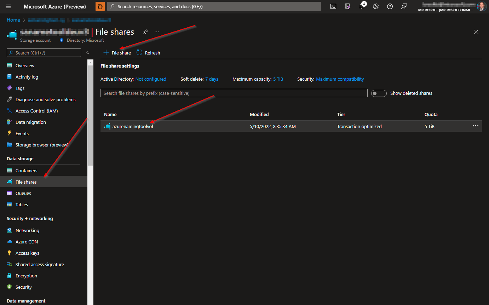
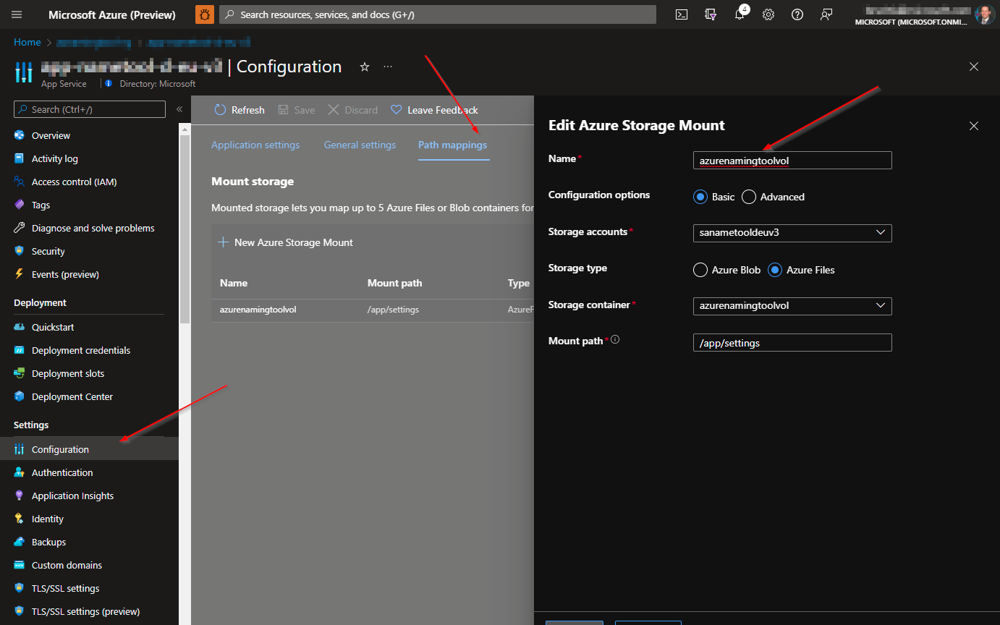

[Overview](./) | [Installation](INSTALLATION.md) | [Updating](UPDATING.md) | [Using the API](USINGTHEAPI.md)

# Azure Naming Tool v2 - Installation


[How To Install](#how-to-install)

* [Run as a Docker image](#run-as-a-docker-image)

* [Run as an Azure App Service Container](#run-as-an-azure-app-service-container)

* [Run as a Stand-Alone Site](#run-as-a-stand-alone-site)

## How To Install

This project contains a .NET 6 application, with Docker support. To use, complete the following:

> **NOTE:**
> The Azure Naming Tool requires persistent storage for the configuration files when run as a container. The following processes will explain how to create this volume in your respective environment. All configuration JSON files will be stored in the volume to ensure the configuration is persisted.

### Run as a Docker image

This process will allow you to deploy the Azure Naming Tool using Docker to your local environment.

1. Scroll up to the top, left corner of this page.
2. Click on the **CloudAdoptionFramework** link to open the root of this repository.
3. Click the green **<>Code** button and select **Download ZIP**.
4. Open your Downloads folder using File Explorer.
5. Extract the contents of the ZIP archive.

> **NOTE:**
> Validate the project files extracted successfully and match the contents in the GitHub repository.

6. Open a **Command Prompt**
7. Change the directory to the **AzNamingTool** folder. For example:

```cmd
cd .\Downloads\CloudAdoptionFramework-master\CloudAdoptionFramework-master\ready\AzNamingTool
```

8. Run the following **Docker command** to build the image:

```cmd
docker build -t azurenamingtool .
```
  
> **NOTE:**
> Ensure the '.' is included in the command

9. Run the following **Docker command** to create a new container and mount a new volume:

```cmd
docker run -d -p 8081:80 --mount source=azurenamingtoolvol,target=/app/settings azurenamingtool:latest
```

> **NOTES:**  
> * Substitute 8081 for any port not in use on your machine
> * You may see warnings in the command prompt regarding DataProtection and keys. These indicate that the keys are not persisted and are only local to the container instances.

10. Access the site using the following URL: *http://localhost:8081*
  
> **NOTE:**
> Substitute 8081 for the port you used in the docker run command

***

### Run as an Azure App Service Container

The Azure Naming Tool requires persistent storage for the configuration files when run as a container. The following processes will explain how to create this volume for your Azure App Service Container. All configuration JSON files will be stored in the volume to ensure the configuration is persisted.

> **NOTE:**
> For many of the steps, a sample process is provided, however, there are many ways to accomplish each step.

1. Scroll up to the top, left corner of this page.
2. Click on the **CloudAdoptionFramework** link to open the root of this repository.
3. Click the green **<>Code** button and select **Download ZIP**.
4. Open your Downloads folder using File Explorer.
5. Extract the contents of the ZIP archive.

> **NOTE:**
> Validate the project files extracted successfully and match the contents in the GitHub repository.

6. Open a **Command Prompt**
7. Change the directory to the **AzNamingTool** folder. For example:

```cmd
cd .\Downloads\CloudAdoptionFramework-master\CloudAdoptionFramework-master\ready\AzNamingTool
```

8. Run the following **Docker command** to build the image:

```cmd
docker build -t azurenamingtool .
```
  
> **NOTE:**
> Ensure the '.' is included in the command
  
9. Create an Azure Container Registry: [Microsoft Docs reference](https://docs.microsoft.com/en-us/azure/container-registry/container-registry-get-started-portal#:~:text=%20Quickstart%3A%20Create%20an%20Azure%20container%20registry%20using,must%20log%20in%20to%20the%20registry...%20More%20)
10. Build and publish your image to the Azure Container Registry: [Microsoft Docs reference](https://docs.microsoft.com/en-us/azure/container-registry/container-registry-get-started-docker-cli?tabs=azure-cli)
11. Create an Azure Files file share for persistent storage: [Microsoft Docs reference](https://docs.microsoft.com/en-us/azure/storage/files/storage-how-to-create-file-share?tabs=azure-portal)
  
  

12. Create an Azure App Service - Web App: [Microsoft Docs reference](https://docs.microsoft.com/en-us/azure/app-service/quickstart-custom-container?tabs=dotnet&pivots=container-linux)
13. Mount the file share as local storage for the Azure App Service: [Microsoft Docs reference](https://docs.microsoft.com/en-us/azure/app-service/configure-connect-to-azure-storage?tabs=portal&pivots=container-linux)
  
  

14. Deploy the image from the Azure Container Registry to the Azure App Service: [Microsoft Docs reference](https://docs.microsoft.com/en-us/azure/app-service/deploy-ci-cd-custom-container?tabs=acr&pivots=container-linux)
15. Access the site using your Azure App Service URL

***

### Run as a Stand-Alone Site

The Azure Naming Tool can be installed as a stand-alone .NET Core application. The installation process will vary, depending on your hosting environment.

To install as a stand-alone site:

1. Scroll up to the top, left corner of this page.
2. Click on the **CloudAdoptionFramework** link to open the root of this repository.
3. Click the green **<>Code** button and select **Download ZIP**.
4. Open your Downloads folder using File Explorer.
5. Extract the contents of the ZIP archive.

> **NOTE:**
> Validate the project files extracted successfully and match the contents in the GitHub repository.

6. In your IIS/Apache environment, create a new .NET application with the Azure Naming Tool source for the directory


