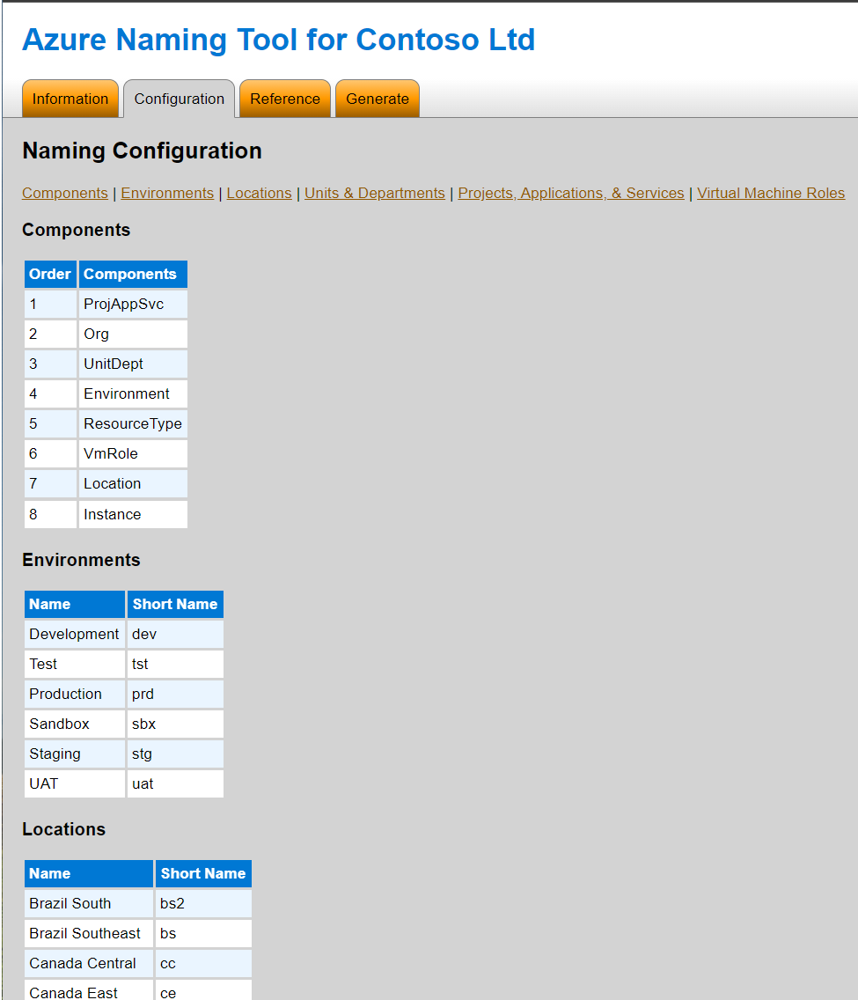

# Azure Naming Tool

## Description

The Azure Naming Tool was built to accelerate Azure deployments using the [Cloud Adoption Framework (CAF)](https://docs.microsoft.com/en-us/azure/cloud-adoption-framework/) as a baseline. Recognizing the lengthy, complex process it was for organizations to develop a standardized naming convention, the tool takes the complexity out of the process to generate a customizable naming convention within minutes.

The Azure Naming Tool creates a custom naming reference guide and name generator for your Azure deployments. The tool initially begins with running a PowerShell script to collect organizational specific naming preferences.  This data is collected and stored in the "configuration.csv" file. The script also outputs an HTML file.  The HTML file contains both the reference guide and name generator using the data collected from the PowerShell script. These artifacts can be used to submit for approvals, accelerate deployments, and enhance overall governance practices.

If the naming convention needs to be adjusted, the organizational specific data can edited in the CSV files before re-executing the PowerShell Script again. This will generate a new HTML file containing the updated reference guide and name generator.

> **Important** - Due to the relative paths integrated within the script, you **MUST** run the script from the same directory where it is stored on your file system.

## Azure Naming Tool Components

### Data Collection and Output Files

- **PowerShell Script**  - The "Get-AzureNamingConfiguration.ps1" script is utilized for collecting naming preferences and organizational data to customize the HTML file.

- **Configuration CSV** - The "configuration.csv" file contains the selections captured during each run of the script.  Each time the script is run, this file is over written with the latest changes. In order to update these values, you **MUST** re-run the "Get-AzureNamingConfiguration.ps1" script.  This is to ensure the script can validate input, incorporate the values appropriately, and add them to the HTML based tool.

    > **NOTE**
    > It is **not** recommended to manually edit this file.

- **HTML File** - The "AzureNamingTool.html" file contains embedded JavaScript and CSS that is used to used to build the tools and style the page.  These features will need to be enabled in your browser for the tool to work appropriately.

### Static Data Files

- **Environments CSV** - The "environments.csv" file is a static list of the suggested environments (e.g. Development, Test, etc.) with a 3 letter short name for each environment.

- **Azure Locations** - The "locations.csv" file is a static list of Azure's public locations (datacenters) with 2 or 3 alphanumeric short names for each location.

- **Azure Resources CSV** - The "resources.csv" file is a static collection of Azure's resources and associated naming restrictions (e.g. allowed characters, name lengths, abbreviations, etc.).
There are only 3 field that should be modified in this CSV:
    1. OPTIONAL: the components of your naming convention that can be optional for a specific resource type.
    1. EXCLUDE: the components of your naming convention that can be excluded for a specific resource type.
    1. SHORTNAME: the short name for each resource type.
  
- **VM Specific Roles CSV** - The "vmRoles.csv" file is a static collection of common server roles (e.g. DC, DNS, etc.) installed on Azure virtual machines with 2 letter short names for each role.

## How to Use  

1. Download the GitHub Repo to a ZIP file.
1. Extract the ZIP file to your local file system.
1. Open PowerShell.
1. Change your working directory to the location of the extracted ZIP file.
1. Call the "AzureNamingConfiguration.ps1" script.

    ```powershell  
    .\Set-AzureNamingConfiguration.ps1
    ```

1. Provide input for each of the questions to build out the configuration information for the Naming Tool.
    - QUESTION 1: Remove the unwanted naming components
        - The "Org" component cannot be removed and is only used to name high level resources, like subscriptions and management groups.  Refer to the "Include" and "Exclude" columns in the "resources.csv" to see which resources use the Org component.
        - The "VM Role" is only allowed on virtual machine resources based on the inclusions and exclusions in the "resources.csv" file.
    - QUESTION 2: Order the desired naming components  
    - QUESTION 3: Choose delimiter between naming components
    - QUESTION 4: Organization name and shortname  
    - QUESTION 5: Business units and departments
    - QUESTION 6: Remove unwanted Environments
    - QUESTION 7: Projects, Applications, and / or Services

1. Using File Explorer, open the directory of the extracted ZIP file
1. Open the "AzureNamingTool.html".
1. Select a tab to open the appropriate tool:  
    - Reference - provides a list of all Azure services within the noted scopes, examples, and acceptable syntax.  
    - Generator - allows you to create names based on your previously provided information for Azure resources in the noted scopes.  

    > **Note**  
    > Ensure you adjust the instance number according to your needs and your organization has adopted the naming strategy.  

### Customizations

Any of the CSV files in the Data subfolder can be modified to meet your needs. Below are the most commonly customized sections or settings.
Consider reviewing the "Static Data Files" section for a summary of each CSV file.

#### Locations

To update the location short names:

1. Open the 'data' subfolder.
1. Open the 'locations.csv' file in your favorite editor (i.e. Excel).
1. Consider the following with setting or changing region codes:

    - Keep them unique so they are easily distinguishable with others
    - Make sure they are short so they can be concatenated together with out exceeding limits for overall resource names. (Typically 3-4 characters at most)

#### VM Roles

These short names are based on commonly deployed roles but as with any organization, are highly subjective.  To update the VM roles and short names:

1. Open the 'data' subfolder.
1. Open the 'vmRoles.csv' file in your favorite editor (i.e. Excel).
1. Consider the following with these names or values:

    - Keep them unique as you would for the region codes so they are distinguishable.
    - Also keep them as short as possible considering they are part of the overall resource name and subject to character limits as a whole.

> **Important**  
> Any **changes** to the CSV files in the data subfolder require you to **re-run** the script to recompile your customizations for the naming tool!

## References  

[Cloud Adoption Framework (Main Page)](https://docs.microsoft.com/en-us/azure/cloud-adoption-framework/)  
[Define your naming convention](https://docs.microsoft.com/en-us/azure/cloud-adoption-framework/ready/azure-best-practices/resource-naming)  
[Naming and tagging conventions tracking template](https://raw.githubusercontent.com/microsoft/CloudAdoptionFramework/master/ready/naming-and-tagging-conventions-tracking-template.xlsx)  

## Output Example

### Tool Information


### Configuration Overview



### Reference Guide for Azure Services with Examples


### Azure Name Generator


